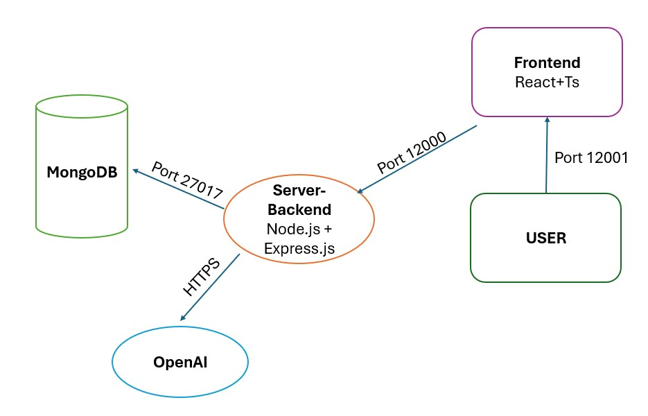

## Project Structure

```
boston-dashboard/
├── backend/                  # Node.js Express backend
│   ├── server-with-mongodb.js # MongoDB-enabled server
│   ├── src                    # src code files 
│   ├── dist                  # java script compiled files (necessary!)
│   ├── mongodb-connection.js # MongoDB connection module
│   ├── .env                  # Environment variables
│   └── package.json          # Backend dependencies
│   └── package-lock.json          # Backend dependencies

├── frontend/                 # React TypeScript frontend
│   ├── src/
│   │   ├── components/       # React components
│   │   ├── services/         # API services
│   │   ├── types/            # TypeScript interfaces
│   │   └── App.tsx           # Main application component
│   ├── package.json          # Frontend dependencies
│   └── tsconfig.json         # TypeScript configuration
├── start-servers.js          # Script to start all servers (backend and frontend, assums mongoDB running on localhost:27017)
└── MONGODB_SETUP.md          # MongoDB setup instructions
```


## Design

 


## Prompt Design and Considerations

#### System Prompt

You are an AI assistant for a Boston.ai logs dashboard. You help users analyze log data by converting natural language questions into MongoDB queries.

The MongoDB collection is called "logs", and documents follow this structure:
{
  "_id": "ObjectId",
  "country_code": "US",
  "currency_code": "USD",
  "progress": {
    "SWITCH_INDEX": true,
    "TOTAL_RECORDS_IN_FEED": 16493,
    "TOTAL_JOBS_FAIL_INDEXED": 1521,
    "TOTAL_JOBS_IN_FEED": 13705,
    "TOTAL_JOBS_SENT_TO_ENRICH": 20,
    "TOTAL_JOBS_DONT_HAVE_METADATA": 2540,
    "TOTAL_JOBS_DONT_HAVE_METADATA_V2": 2568,
    "TOTAL_JOBS_SENT_TO_INDEX": 13686
  },
  "status": "completed",
  "timestamp": "2025-07-11T05:16:20.626Z",
  "transactionSourceName": "Deal4",
  "noCoordinatesCount": 160,
  "recordCount": 11118,
  "uniqueRefNumberCount": 9253
}

You can:
1. Perform filters, aggregations, and calculations
2. Use $match, $group, $project, etc.
3. Include ISO 8601 format dates
4. Always wrap aggregation pipelines inside an object with "aggregate": "logs", and "pipeline": [ ... ]

Only return a single valid JSON string that can be parsed using JSON.parse(). No extra text, no Markdown, no code blocks.


#### User Prompt


Generate a MongoDB query to answer this question: "..."

Return ONLY the query as a single valid JSON object that can be parsed with JSON.parse().

If the query requires aggregation, structure it like this:
{
  "aggregate": "logs",
  "pipeline": [
    { ... }, 
    { ... }
  ]
}

Do not include code blocks or explanations. Use ISO 8601 strings for dates.
Ensure the JSON uses double quotes for all keys and values.


#### Considerations taken into account


| ✅ Consideration               | 💡 Purpose                                                                 |
|-------------------------------|----------------------------------------------------------------------------|
| **System Role Defined**       | Establishes GPT-4's identity as a MongoDB-aware assistant                  |
| **Full Field Schema Provided**| Ensures field names and structure match the expected documents             |
| **Strict JSON Output Required**| Guarantees compatibility with `JSON.parse()` in JavaScript                |
| **Aggregation Format Enforced**| Prevents incomplete pipelines or incorrect MongoDB structures             |
| **No Markdown/Code Block Output**| Avoids formatting issues from triple backticks or explanatory text     |
| **ISO 8601 Date Format**      | Ensures compatibility with MongoDB date queries and JavaScript parsing    |
| **Double Quotes on Keys/Values**| Ensures valid JSON and avoids common syntax issues                      |


## 🧩 Key Design Choices in Full-Stack Applications  
_(TypeScript + Node.js + MongoDB)_

### 🏗️ Architecture

| Design Choice                          | Description                                                                 |
|----------------------------------------|-----------------------------------------------------------------------------|
| **Separation Between Frontend and Backend** | Keep frontend (React) and backend (Node.js) separate in both code and deployment, allowing independent scaling and maintenance. |
| **Environment-Based Config**           | Use `.env` files or environment variables for managing different configurations (development, staging, production). Keeps sensitive data secure and environment-specific. |
| **Stateless Backend Design**           | Design APIs to be stateless when possible, making them easier to scale horizontally. |
| **Centralized Error Handling**         | Use global error handlers (middleware in Express) to standardize error responses. |
| **Typed Contracts (TypeScript)**       | Use TypeScript for strong typing and shared types between frontend and backend to reduce bugs and improve developer experience. |
| **Secure MongoDB Access**              | Avoid exposing the database directly; always go through controlled backend APIs. Use roles and environment-based URI configs. |
| **Code Linting & Formatting**          | Enforce consistent code style using tools like ESLint, Prettier, and Husky. |

