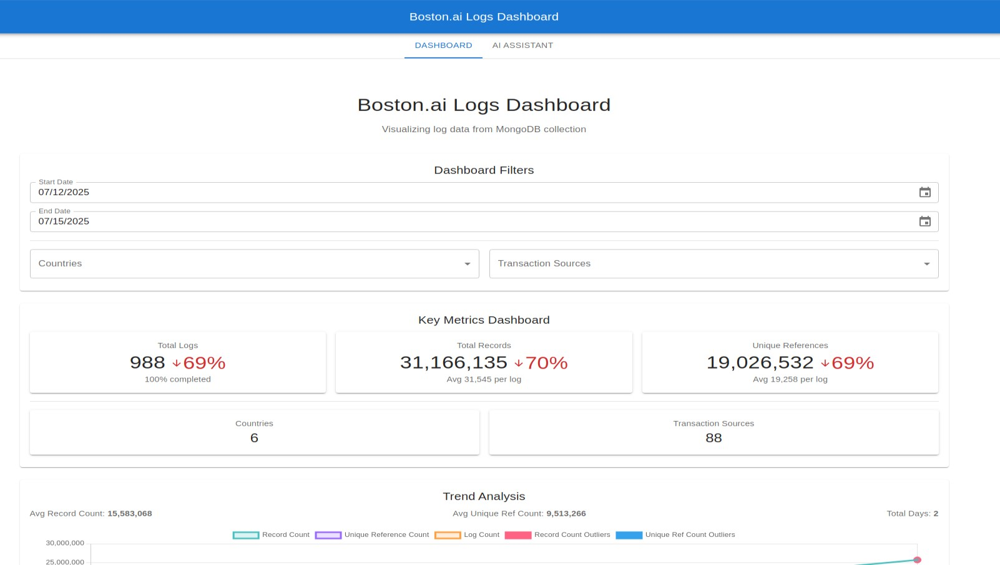
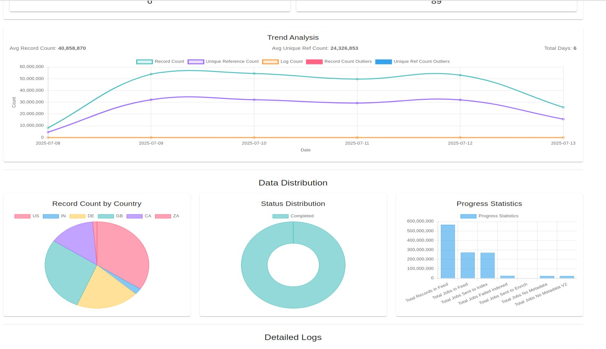
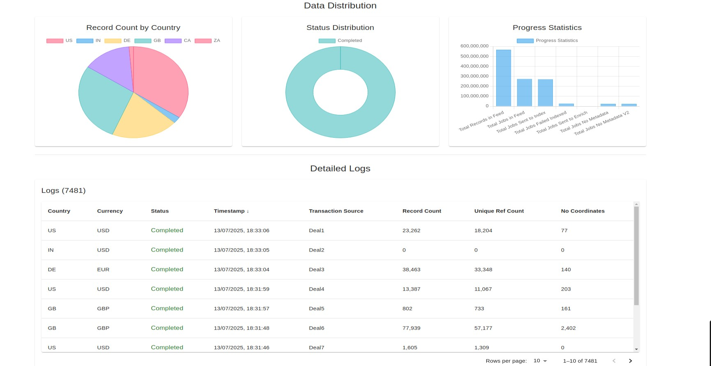
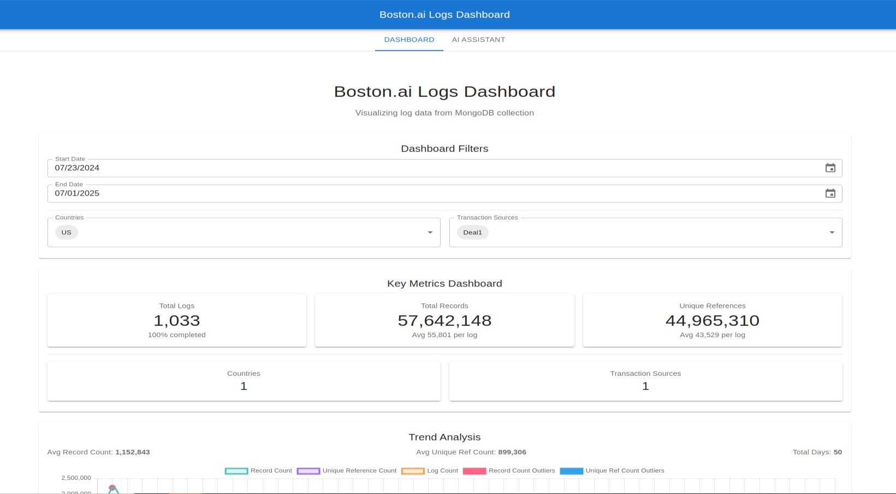
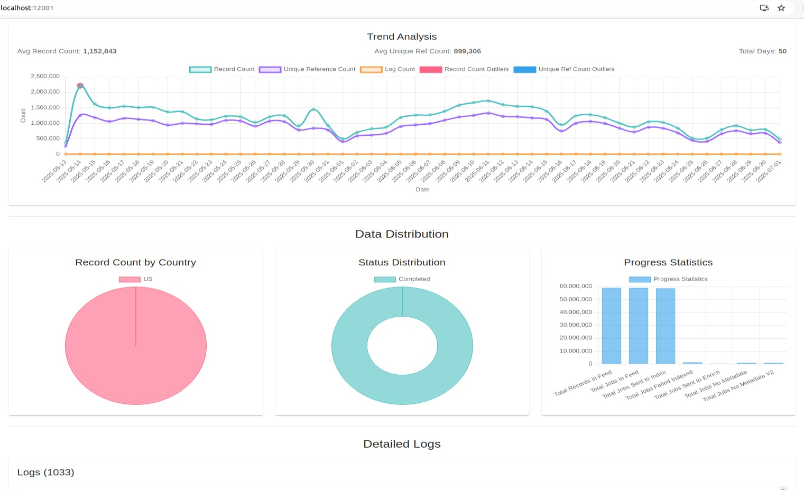
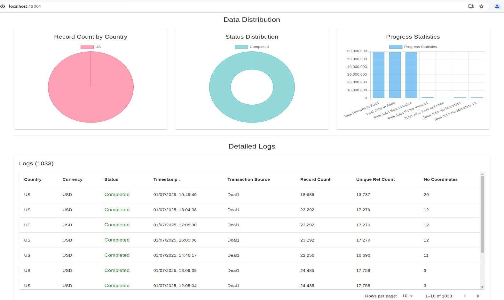
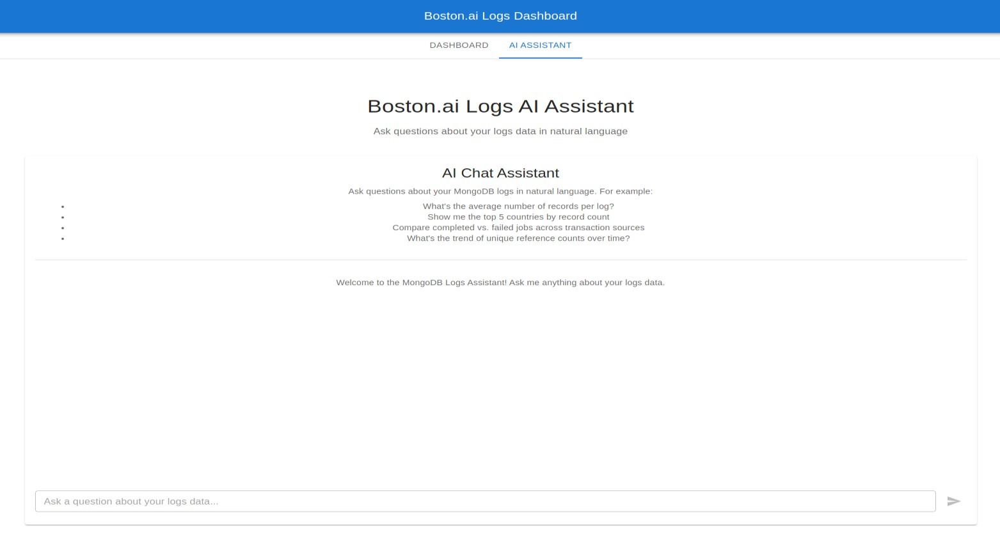
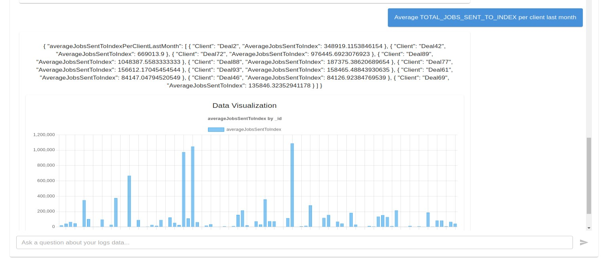
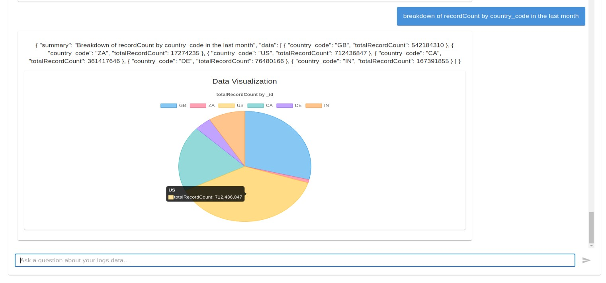
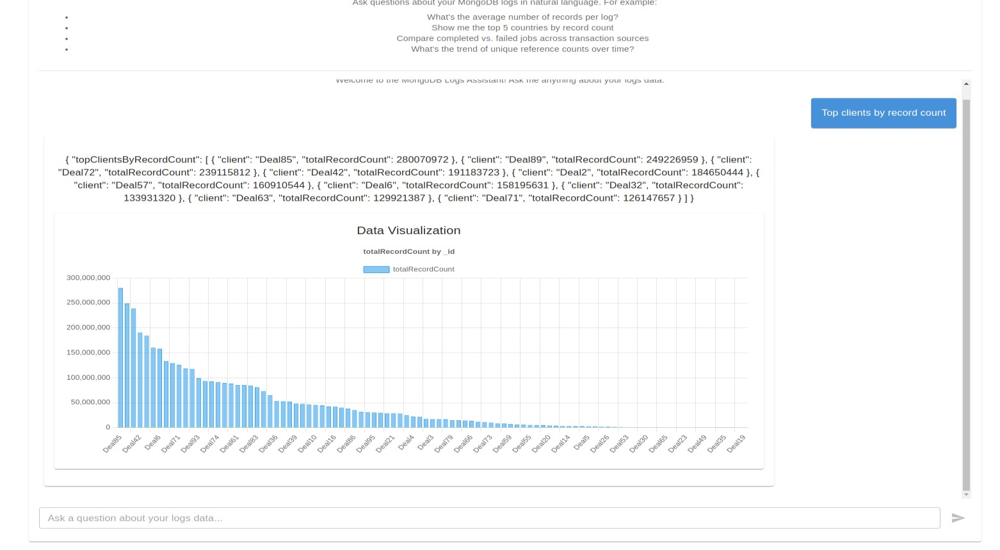

# boston.AI Dashboard

A full-stack web application that visualizes statistics from job applications.

## Features

- Dashboard with multiple charts showing data statistics 
   - 
   - Country distribution chart
   - Status distribution chart
   - Progress metrics chart
   - Logs table with recent entries
   - Date range picker for filtering logs by timestamp
   - Trend Analysis
- AI Assistnace that plot charts based on a natural language query

openhands
## Tech Stack

### Backend
- Node.js
- Express.js

### Frontend
- React
- TypeScript
- Material-UI for components
- Chart.js for data visualization


## Getting Started

### Prerequisites

- Node.js (v14 or higher)
- MongoDB (for MongoDB integration) running on localhost:27017, can be configured on .env file (``MONGODB_URI``)

### Installation

1. Clone the repository
2. Install backend dependencies:
   ```
   cd backend
   npm install
   ```
3. Install frontend dependencies:
   ```
   cd frontend
   npm install
   ```

### Running the Application

#### Assuming MongoDB is Running on localhost:27017 with collection named logs.

Run both servers with the provided script:

```
./start-servers.sh
```

This will start:
- Backend server on port 12000 (with sample data)
- Frontend server on port 12001

Access the application at:
- Backend API: http://localhost:12000
- Frontend UI: http://localhost:12001


### Installing MongoDB (using docker)

1. docker pull library/mongo
2. docker run -p 27017:27017 -t mongo library/mongo
3. create a collection named "logs"
4. load the boston.ai data to the collection  

## Data Format

The application works with logs in the following format:

```json
{
 "_id": "68709db2402cf56cd3813d9e",
 "country_code": "US",
 "currency_code": "USD",
 "progress": {
   "SWITCH_INDEX": true,
   "TOTAL_RECORDS_IN_FEED": 16493,
   "TOTAL_JOBS_FAIL_INDEXED": 1521,
   "TOTAL_JOBS_IN_FEED": 13705,
   "TOTAL_JOBS_SENT_TO_ENRICH": 20,
   "TOTAL_JOBS_DONT_HAVE_METADATA": 2540,
   "TOTAL_JOBS_DONT_HAVE_METADATA_V2": 2568,
   "TOTAL_JOBS_SENT_TO_INDEX": 13686
 },
 "status": "completed",
 "timestamp": "2025-07-11T05:16:20.626Z",
 "transactionSourceName": "Deal4",
 "noCoordinatesCount": 160,
 "recordCount": 11118,
 "uniqueRefNumberCount": 9253
}
```
<!--
## Dashboard Examples






### FIltering by a Country (US)






 -->

## Dashboard Examples

### General Overview


### Filtering by Country (US)


 

## AI Chat Assistant Examples

### General Overview



### Queries
 

